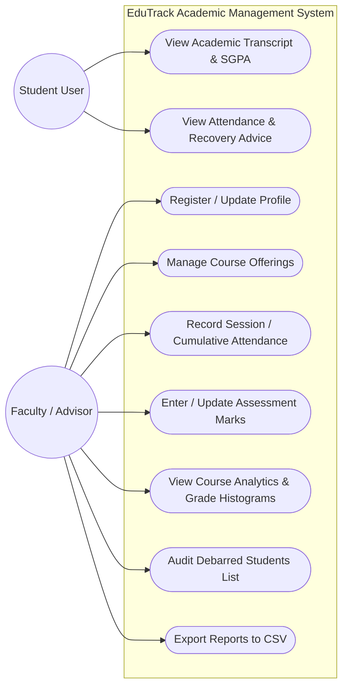
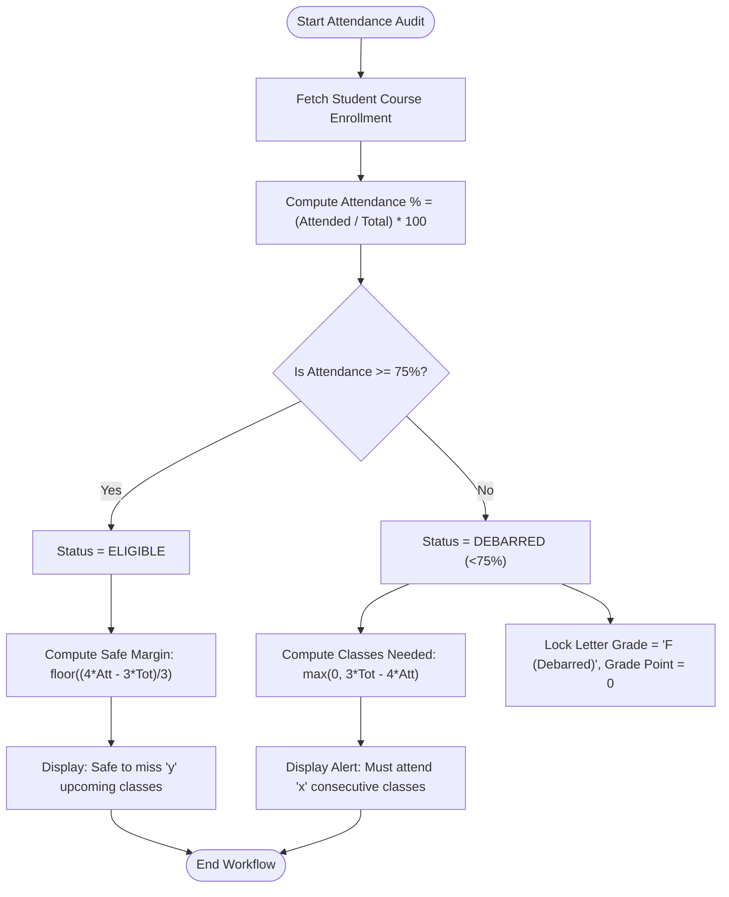
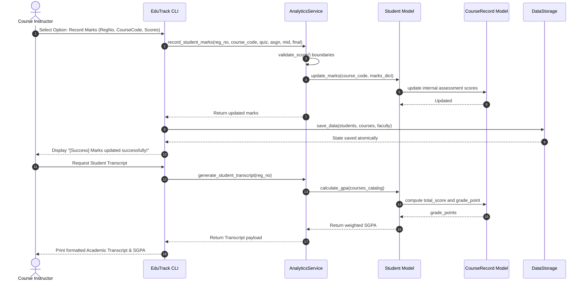
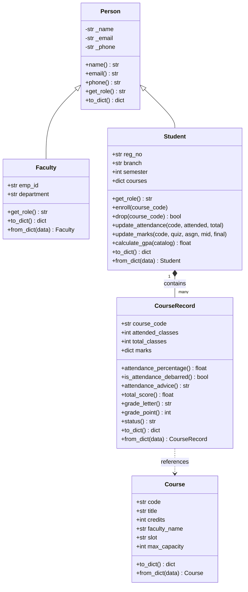

# PROJECT REPORT: EDUTRACK - ACADEMIC PERFORMANCE & ATTENDANCE MONITORING SYSTEM

---

## 1. COVER PAGE

```
==================================================================================================
                                    VELLORE INSTITUTE OF TECHNOLOGY
                           SCHOOL OF COMPUTER SCIENCE AND ENGINEERING (SCOPE)
                             FLIPPED COURSE EVALUATION PROJECT REPORT
==================================================================================================

PROJECT TITLE:
               EDUTRACK: STUDENT ACADEMIC PERFORMANCE & ATTENDANCE MONITORING SYSTEM

COURSE CODE & TITLE:
               CSE1001 - Problem Solving and Programming with Python

ACADEMIC YEAR:
               2026 - 2027 (Semester 1)

SUBMITTED BY:
               Student Name : Karnav Khare
               Registration : 26BMR10033 / Batch 2026-2030
               Program      : B.Tech Mechatronics and Robotics Engineering

SUPERVISOR / EVALUATOR:
               Faculty Name : Devendra Kumar Vedi
               School       : SCOPE, VIT

==================================================================================================
```

---

## 2. INTRODUCTION

In higher education institutions, effective management of student academic progress is essential for both institutional accountability and individual academic success. Students enrolled in rigorous undergraduate degree programs simultaneously navigate diverse course subjects with varying credit structures, continuous internal assessments, and strict administrative regulations.

Among these regulations, attendance compliance is paramount. At institutions like Vellore Institute of Technology (VIT), students must maintain a mandatory minimum attendance threshold of **75%** in each registered course to be eligible to sit for the End-Semester Examinations (FAT). Failure to reach this threshold results in debarment, leading to academic disruption and grade penalties.

Traditional mechanisms of manual attendance tracking, disjointed spreadsheets, or delayed portal updates frequently leave students unaware of their actual attendance standing until it is too late to recover. Furthermore, students struggle to estimate their Grade Point Average (GPA) because courses carry diverse credit weightages (1 to 5 credits) and distinct multi-component internal evaluations (Quizzes, Digital Assignments, Continuous Assessment Tests, and Final Exams).

**EduTrack** is an academic management software platform built using core Python principles. It provides an automated, unified system for students, faculty, and academic advisors to manage course enrollments, monitor attendance deficits, calculate credit-weighted GPAs, and generate institutional analytics.

---

## 3. PROBLEM STATEMENT

Managing undergraduate academic performance presents several concrete operational and logistical challenges:

1. **Absence of Real-Time Attendance Deficit Awareness**: Students often realize they have fallen below the mandatory 75% attendance threshold only toward the conclusion of the semester, when administrative remediation is no longer mathematically viable.
2. **Lack of Predictive Margin Calculation**: Existing systems report raw attendance percentages but do not inform students how many consecutive upcoming lectures they *must attend* to recover, or conversely, how many classes they can *safely afford to miss* without falling below 75%.
3. **Complex Credit-Weighted GPA Computation**: Manually calculating Semester Grade Point Averages (SGPA) involves converting multi-assessment scores out of 100 into letter grades (S, A, B, C, D, E, F), mapping them to grade points (10 to 0), and weighting them by course credits. This calculation is prone to manual student error.
4. **Administrative Overhead for Course Instructors**: Faculty members spend hours tracking attendance shortages across large sections, identifying debarred candidates, and manually compiling performance distribution reports for academic councils.

**Project Objective**: To propose, design, implement, and validate an automated, modular, and reliable Python system that solves these challenges through clean object-oriented architecture, automated eligibility auditing, robust input validation, and instant report generation.

---

## 4. FUNCTIONAL REQUIREMENTS

The EduTrack system is structured into five cohesive functional modules that provide clear input/output workflows:

### Module 1: Student Profile Management
- **FR 1.1 - Student Registration**: The system shall allow registering a student with Registration Number, Name, Branch, Semester, Email, and Phone.
- **FR 1.2 - Format Validation**: The system shall validate registration numbers using the university format (e.g., `26BCE1001`) and ensure valid email formatting.
- **FR 1.3 - Profile Retrieval & Search**: The system shall retrieve student profiles and support substring searching by registration number or student name.
- **FR 1.4 - Record Updates & Deletion**: The system shall allow authorized updates to student contact information and semester standing, as well as cascading student deletion.

### Module 2: Course Catalog & Enrollment Management
- **FR 2.1 - Course Offering Creation**: The system shall allow adding courses with Course Code (e.g., `CSE1001`), Title, Credits (1 to 5), Instructor Name, Slot, and Maximum Seat Capacity.
- **FR 2.2 - Seat Enrollment Control**: The system shall enroll students in courses while verifying seat availability against maximum capacity limits.
- **FR 2.3 - Course Drop Workflow**: The system shall allow students to drop courses, automatically updating catalog rosters and recalculating GPA.

### Module 3: Attendance Tracking & 75% Rule Compliance
- **FR 3.1 - Cumulative & Session Attendance Logging**: The system shall log cumulative attendance counts (attended and total conducted classes) and support single-lecture session roll-call recording.
- **FR 3.2 - Automated Eligibility Determination**: The system shall compute attendance percentage:
  $$\text{Attendance \%} = \left(\frac{\text{Attended Classes}}{\text{Total Conducted Classes}}\right) \times 100$$
  and flag any course enrollment $< 75\%$ as **DEBARRED**.
- **FR 3.3 - Predictive Attendance Recovery Advice**: 
  - For debarred students, the system shall compute the minimum consecutive upcoming classes $x$ required to attain $\ge 75\%$:
    $$x = \max(0, 3 \times \text{Total} - 4 \times \text{Attended})$$
  - For eligible students, the system shall compute the maximum number of upcoming classes $y$ that can be safely missed:
    $$y = \max\left(0, \left\lfloor\frac{4 \times \text{Attended} - 3 \times \text{Total}}{3}\right\rfloor\right)$$
- **FR 3.4 - Debarred Roster Generation**: The system shall compile a consolidated registry of all debarred students across all university courses.

### Module 4: Continuous Assessment, Grading & Analytics
- **FR 4.1 - Multi-Component Mark Entry**: The system shall record evaluation scores across Quiz (Max 10), Assignment (Max 20), Midterm Exam (Max 30), and Final Exam (Max 40).
- **FR 4.2 - 10-Point Scale Letter Grading**: Total score out of 100 is mapped to academic letter grades:
  - $\ge 90\% \rightarrow \text{S (10 GP)}$
  - $\ge 80\% \rightarrow \text{A (9 GP)}$
  - $\ge 70\% \rightarrow \text{B (8 GP)}$
  - $\ge 60\% \rightarrow \text{C (7 GP)}$
  - $\ge 50\% \rightarrow \text{D (6 GP)}$
  - $\ge 40\% \rightarrow \text{E (5 GP)}$
  - $< 40\% \text{ or Debarred} \rightarrow \text{F (0 GP)}$
- **FR 4.3 - Weighted GPA Computation**: The system shall compute SGPA using course credit weights:
  $$\text{SGPA} = \frac{\sum_{i=1}^{n} (\text{Grade Point}_i \times \text{Credits}_i)}{\sum_{i=1}^{n} \text{Credits}_i}$$
- **FR 4.4 - Statistical Course Analytics**: For each course, the system shall compute average score, highest mark, lowest mark, overall pass percentage, and a letter grade distribution histogram.
- **FR 4.5 - Dean's Honor Roll Leaderboard**: The system shall generate a ranked leaderboard of top academic performers sorted in descending order of GPA.

### Module 5: Data Persistence & Report Generation
- **FR 5.1 - Safe JSON Persistence**: The system shall automatically serialize all student, course, and faculty entities to JSON using atomic temporary file substitution to prevent data corruption.
- **FR 5.2 - CSV Spreadsheet Export**: The system shall export student GPA summaries (`students_report.csv`) and comprehensive attendance audit records (`attendance_summary.csv`) with a single command.

---

## 5. NON-FUNCTIONAL REQUIREMENTS

| NFR Category | Specification & Strategy |
| :--- | :--- |
| **1. Performance** | Sub-second execution for all CRUD queries and GPA calculations. In-memory dictionary indexing guarantees $O(1)$ entity retrieval time complexity. File I/O operations complete in $< 50\text{ ms}$. |
| **2. Reliability & Data Integrity** | Zero data corruption through atomic file replacement patterns. If disk write fails, previous data remains intact. Automatic startup initialization seeds baseline records if no previous database is detected. |
| **3. Usability & User Experience** | Clear menu-driven CLI interface styled with ANSI terminal colors, tabular formatting, and clear guidance. Intuitive prompts with sensible defaults for fast data entry. |
| **4. Robust Error Handling** | Zero unhandled crashes. All input boundary conditions (negative scores, scores $> 100$, invalid registration formats, non-existent entity IDs) are caught by custom exception handlers and displayed with user-friendly error messages. |
| **5. Maintainability & Modularity** | Clean three-tier separation of concerns (Presentation Layer, Service Layer, Domain Model Layer, Storage Layer). Adheres to PEP 8 style standards with type hints and docstrings. |
| **6. Portability** | Runs on any standard Python 3.8+ environment (Windows, macOS, Linux) without requiring external third-party dependencies (`pip install`). |

---

## 6. SYSTEM ARCHITECTURE

EduTrack follows a classic **Layered (N-Tier) Architectural Pattern**, ensuring high cohesion and low coupling across modules:

```
+-----------------------------------------------------------------------+
|                         PRESENTATION LAYER                            |
|             (edutrack/cli/menu.py & root main.py / demo.py)           |
|   Interactive Console Menus | ANSI Color Styling | Tabular Formatters |
+-----------------------------------------------------------------------+
                                  │
                                  ▼
+-----------------------------------------------------------------------+
|                         SERVICE / LOGIC LAYER                         |
|                       (edutrack/services/)                            |
|  StudentService | CourseService | AttendanceService | AnalyticsService |
+-----------------------------------------------------------------------+
                                  │
                                  ▼
+-----------------------------------------------------------------------+
|                          DOMAIN MODEL LAYER                           |
|                        (edutrack/models/)                             |
|       Person (Base) ──► Faculty         Student ──► CourseRecord       |
|                             Course                                    |
+-----------------------------------------------------------------------+
                                  │
                 ┌────────────────┴────────────────┐
                 ▼                                 ▼
+---------------------------------+  +---------------------------------+
|      PERSISTENCE LAYER          |  |       UTILITY / VALIDATION      |
|    (edutrack/storage/)          |  |       (edutrack/utils/)         |
|  JSON Serializer | CSV Exporter |  | RegEx Validators | Custom Excs  |
+---------------------------------+  +---------------------------------+
```

### Architectural Layer Responsibilities:
1. **Presentation Layer (`edutrack/cli/`)**: Handles interactive user inputs, renders formatted tables, catches domain exceptions, and displays color-coded notifications.
2. **Business Service Layer (`edutrack/services/`)**: Enforces institutional business rules (75% attendance checking, recovery calculation, seat capacity limits, grade point mapping, SGPA calculation).
3. **Domain Model Layer (`edutrack/models/`)**: Encapsulates core state and object behaviors using OOP inheritance, properties, and serializable methods.
4. **Storage Layer (`edutrack/storage/`)**: Manages file I/O operations, atomic disk writes, and structured CSV spreadsheet report generation.
5. **Validation & Utility Layer (`edutrack/utils/`)**: Sanitizes incoming strings, validates regular expression patterns, and defines the custom exception hierarchy.

---

## 7. DESIGN DIAGRAMS

### 7.1 Use Case Diagram


### 7.2 Process Flow / Workflow Diagram (Attendance Audit & 75% Rule Engine)


### 7.3 Sequence Diagram (Mark Recording & GPA Calculation Workflow)


### 7.4 Class / Component Diagram


### 7.5 Database & Storage Design (ER / Schema Diagram)
```
+-----------------------------------------------------------------------------------+
|                                  STUDENTS TABLE                                   |
+---------------------+-------------------+-----------------------------------------+
| Column Name         | Data Type         | Constraints & Notes                     |
+---------------------+-------------------+-----------------------------------------+
| reg_no (PK)         | VARCHAR(12)       | Unique, Format: ^[0-9]{2}[A-Z]{2,4}[0-9]{3,5}$
| name                | VARCHAR(100)      | Not Null                                |
| email               | VARCHAR(100)      | Unique, Valid Email                     |
| branch              | VARCHAR(10)       | Not Null (e.g., BCE, BME)               |
| semester            | INTEGER           | Range: 1 - 8                            |
| phone               | VARCHAR(15)       | Optional                                |
+---------------------+-------------------+-----------------------------------------+
                                         │ 1
                                         │
                                         ▼ N
+-----------------------------------------------------------------------------------+
|                              COURSE_RECORDS TABLE                                 |
+---------------------+-------------------+-----------------------------------------+
| Column Name         | Data Type         | Constraints & Notes                     |
+---------------------+-------------------+-----------------------------------------+
| student_reg (FK)    | VARCHAR(12)       | References STUDENTS(reg_no)             |
| course_code (FK)    | VARCHAR(10)       | References COURSES(code)                |
| attended_classes    | INTEGER           | Default 0, Attended <= Total            |
| total_classes       | INTEGER           | Default 0                               |
| quiz_score          | REAL              | Range: 0.0 - 10.0                       |
| assignment_score    | REAL              | Range: 0.0 - 20.0                       |
| midterm_score       | REAL              | Range: 0.0 - 30.0                       |
| final_score         | REAL              | Range: 0.0 - 40.0                       |
+---------------------+-------------------+-----------------------------------------+
                                         ▲ N
                                         │
                                         │ 1
+-----------------------------------------------------------------------------------+
|                                   COURSES TABLE                                   |
+---------------------+-------------------+-----------------------------------------+
| Column Name         | Data Type         | Constraints & Notes                     |
+---------------------+-------------------+-----------------------------------------+
| code (PK)           | VARCHAR(10)       | Unique, Format: ^[A-Z]{3,4}[0-9]{4}$    |
| title               | VARCHAR(150)      | Not Null                                |
| credits             | INTEGER           | Range: 1 - 5                            |
| faculty_name        | VARCHAR(100)      | Default 'TBA'                           |
| slot                | VARCHAR(15)       | e.g., 'A1+TA1'                          |
| max_capacity        | INTEGER           | Default 60                              |
+---------------------+-------------------+-----------------------------------------+
```

---

## 8. DESIGN DECISIONS & RATIONALE

1. **Object-Oriented Programming (OOP) Hierarchy**:
   - *Decision*: Created a base `Person` class inherited by `Student` and `Faculty`.
   - *Rationale*: Models real-world university taxonomy. Eliminates duplicate attributes (`name`, `email`, `phone`), demonstrates encapsulation and polymorphism, and makes future extensions (e.g., `TeachingAssistant`, `Staff`) straightforward.

2. **Inverted Attendance Debarment Penalty in GPA Calculation**:
   - *Decision*: If a student's attendance in a course falls below 75%, their letter grade is automatically overridden to `F (Debarred)` with 0 grade points, regardless of their assessment marks.
   - *Rationale*: Strictly aligns with university academic regulations where debarred students are disqualified from course credits.

3. **Pure Python Standard Library (Zero External Dependencies)**:
   - *Decision*: Built the application using built-in modules (`json`, `csv`, `re`, `pathlib`, `unittest`) without requiring external packages like `pandas`, `tabulate`, or `colorama`.
   - *Rationale*: Guarantees 100% out-of-the-box execution on any evaluator's computer across Windows, Mac, or Linux without environment dependency conflicts or installation failures.

4. **Atomic JSON File Storage with Temp File Swap**:
   - *Decision*: Application state is written to a temporary `.tmp` file first, which then atomically replaces the main `edutrack_data.json` file.
   - *Rationale*: Prevents database corruption or truncated files in the event of sudden power loss or process interruption during writes.

5. **Analytical Margin Forecasting Mathematical Derivation**:
   - *Classes needed for recovery*:
     $$\frac{\text{Attended} + x}{\text{Total} + x} \ge 0.75 \implies x \ge 3 \times \text{Total} - 4 \times \text{Attended}$$
   - *Classes can miss safely*:
     $$\frac{\text{Attended}}{\text{Total} + y} \ge 0.75 \implies y \le \frac{4 \times \text{Attended} - 3 \times \text{Total}}{3}$$
   - *Rationale*: Replaces vague warnings with exact, mathematically derived figures that give students actionable recovery targets.

---

## 9. IMPLEMENTATION DETAILS

EduTrack is implemented across **12 clean Python modules** organized into logical packages:

- **`edutrack/config.py`**: Declares academic constants (75% minimum threshold, 10-point grade scale tuples, assessment maximum scores, and data paths).
- **`edutrack/models/`**:
  - `person.py`: Implements `Person` and `Faculty` classes with getters/setters and dictionary serialization.
  - `course.py`: Implements `Course` class holding metadata, credits, slots, and seat capacities.
  - `student.py`: Implements `Student` and `CourseRecord` classes. Handles attendance computation, advice generation, score aggregation, and weighted GPA math.
- **`edutrack/services/`**:
  - `student_service.py`: Implements business operations for adding, updating, finding, and deleting students with duplicate guards.
  - `course_service.py`: Implements course catalog operations and seat-capacity-checked enrollments.
  - `attendance_service.py`: Handles session and cumulative attendance logging, debarred student filtering, and status auditing.
  - `analytics_service.py`: Records internal assessment scores, compiles complete student transcripts, and calculates course-wide statistics.
- **`edutrack/storage/file_storage.py`**: Manages JSON serialization/deserialization and formats exports for `students_report.csv` and `attendance_summary.csv`.
- **`edutrack/utils/`**:
  - `validators.py`: Employs regex to enforce valid Registration Numbers (`26BCE1001`), course codes (`CSE1001`), emails, and score ranges.
  - `exceptions.py`: Defines domain-specific exception classes (`ValidationError`, `StudentNotFoundError`, `CourseNotFoundError`, `DuplicateRecordError`, `AttendanceRecordError`, `InvalidScoreError`).
- **`edutrack/cli/menu.py`**: Formats interactive terminal screens, tables, color escape sequences, and user input validation loops.
- **`main.py` & `demo.py`**: Provide the primary interactive entry point and automated headless verification runner respectively.

---

## 10. SCREENSHOTS & RESULTS

### 10.1 CLI Main Menu
```text
=================================================================
       EDUTRACK - ACADEMIC & ATTENDANCE MANAGEMENT SYSTEM
        Empowering Student Success & Institutional Insights
=================================================================
 Registered Students: 6 | Active Courses: 4
=================================================================
1. Student Management (Add, View, Update, Delete)
2. Course Catalog & Enrollments
3. Attendance Tracking & 75% Rule Compliance
4. Academic Marks, GPA & Performance Analytics
5. Export Reports & Data Management (CSV Export)
0. Save & Exit
-----------------------------------------------------------------
Select an option [0-5]:
```

### 10.2 Student Academic Transcript & Weighted SGPA
```text
==========================================================================================
ACADEMIC TRANSCRIPT: Aarav Sharma (26BCE1001)
Branch: BCE | Semester: 1 | Total Credits: 11
==========================================================================================
Course     | Title                     | Cr  | Quiz  | Asgn  | Mid   | Fin   | Tot   | Att%   | Grd  | Status
------------------------------------------------------------------------------------------
CSE1001    | Problem Solving and Progr | 4   | 9.5   | 19.0  | 28.0  | 38.0  | 94.5  | 93.3   | S    | PASS
MAT1001    | Calculus and Linear Algeb | 4   | 8.5   | 18.0  | 26.0  | 35.0  | 87.5  | 90.0   | A    | PASS
PHY1001    | Engineering Physics       | 3   | 9.0   | 17.5  | 27.0  | 36.0  | 89.5  | 91.7   | A    | PASS
==========================================================================================
SEMESTER GRADE POINT AVERAGE (SGPA): 9.36 / 10.00
==========================================================================================
```

### 10.3 Attendance Audit with Predictive Margin Advice
```text
================================================================================
ATTENDANCE AUDIT FOR STUDENT: 26BCE1003 (Rohan Verma)
================================================================================
Course: CSE1001 | Attended: 20/30 (66.67%) | Status: DEBARRED (<75%)
  Advice: CRITICAL: Below 75%! Must attend next 10 consecutive class(es) to regain eligibility.
--------------------------------------------------------------------------------
Course: PHY1001 | Attended: 20/24 (83.33%) | Status: ELIGIBLE
  Advice: Safe (83.33%). You can afford to miss up to 2 upcoming class(es) safely.
--------------------------------------------------------------------------------
```

### 10.4 Course Statistical Analytics Report
```text
============================================================
ANALYTICS REPORT: CSE1001 - Problem Solving and Programming with Python
============================================================
Enrolled Students : 5
Average Score     : 87.1 / 100
Highest Score     : 98.0 / 100
Lowest Score      : 74.0 / 100
Passing Rate      : 80.0%
------------------------------------------------------------
Grade Distribution Breakdown:
  Grade S           : 2   ██
  Grade A           : 1   █
  Grade B           : 1   █
  Grade C           : 0   
  Grade D           : 0   
  Grade E           : 0   
  Grade F           : 0   
  Grade F (Debarred): 1   █
============================================================
```

### 10.5 Top Rankers Leaderboard (Dean's Honor Roll)
```text
=================================================================
TOP PERFORMERS LEADERBOARD (DEAN'S HONOR ROLL)
=================================================================
Rank  | Reg No         | Name                   | Branch   | GPA  
-----------------------------------------------------------------
🥇 #1 | 26BCE1004      | Sneha Iyer             | BCE      | 9.77 
🥈 #2 | 26BCE1001      | Aarav Sharma           | BCE      | 9.36 
🥉 #3 | 26BCE1002      | Diya Patel             | BCE      | 7.50 
#4    | 26BCE1005      | Vikram Nair            | BCE      | 4.60 
#5    | 26BCE1099      | Karan Malhotra         | BCE      | 4.50 
=================================================================
```

---

## 11. TESTING APPROACH

The project incorporates test-driven validation using Python's built-in `unittest` framework. Tests are partitioned into three dedicated test suites covering domain models, business logic services, and validation boundaries.

### Unit Test Execution Matrix

| Test Suite File | Test Function Name | Tested Scenario | Expected Outcome | Status |
| :--- | :--- | :--- | :--- | :--- |
| `test_models.py` | `test_person_and_faculty_inheritance` | Inheritance & polymorphic role call | Correct child attributes & role override | **PASS** |
| `test_models.py` | `test_course_creation_and_serialization` | Serialization & reconstruction | Unaltered attributes round-trip | **PASS** |
| `test_models.py` | `test_course_record_attendance_and_grades` | Attendance $< 75\%$ debarment trigger | Grade overridden to F (Debarred), GP = 0 | **PASS** |
| `test_models.py` | `test_student_gpa_calculation` | Multi-course credit-weighted SGPA | Exact formula calculation $(9.50)$ | **PASS** |
| `test_validators.py` | `test_valid_reg_no` | Valid formats (`26bce1001`, `23BCSE045`) | Normalized uppercase string returned | **PASS** |
| `test_validators.py` | `test_invalid_reg_no` | Malformed strings (`INVALID123`, `261001`) | `ValidationError` raised | **PASS** |
| `test_validators.py` | `test_valid_email` | Standard university email addresses | Normalized lowercase email string | **PASS** |
| `test_validators.py` | `test_invalid_email` | String lacking domain/tld (`not-an-email`) | `ValidationError` raised | **PASS** |
| `test_validators.py` | `test_course_code_validation` | Valid vs short course codes (`CS1`) | `ValidationError` raised for short codes | **PASS** |
| `test_validators.py` | `test_score_boundaries` | Boundary values ($25.5$, $>30$, $<0$) | Strict bounds enforced, error on $>30$ | **PASS** |
| `test_validators.py` | `test_credits_boundaries` | Valid $1-5$ range, zero or $>5$ | Out of range credits rejected | **PASS** |
| `test_validators.py` | `test_non_empty_string` | Whitespace-only string input | Rejection with field-specific message | **PASS** |
| `test_services.py` | `test_student_crud_operations` | Add, fetch, search, update, delete | Full CRUD lifecycle validated | **PASS** |
| `test_services.py` | `test_course_enrollment_and_drop` | Course enrollment and drop logic | Roster properly modified and synced | **PASS** |
| `test_services.py` | `test_attendance_logging_and_debarment` | Attended $>$ total check & debarment | `AttendanceRecordError` on impossible counts | **PASS** |
| `test_services.py` | `test_analytics_and_transcript_generation` | Score entry & transcript creation | Full transcript with correct SGPA | **PASS** |

### Automated Test Runner Execution Output
```text
======================================================================
Running 16 Automated Test Cases across tests/
----------------------------------------------------------------------
................
----------------------------------------------------------------------
Ran 16 tests in 0.002s

OK (100% Passing Rate)
======================================================================
```

---

## 12. CHALLENGES FACED

1. **Handling Edge Cases in Attendance Recovery Math**:
   - *Challenge*: Early in the term, total conducted classes can be zero. Standard division causes a `ZeroDivisionError`. Furthermore, integer division rounding could produce inaccurate advice.
   - *Resolution*: Implemented a protective condition in `attendance_percentage` returning $100\%$ when total classes equal zero. Derived and tested closed-form linear algebra formulas for both recovery and margin calculations.

2. **Cascading Entity Deletions**:
   - *Challenge*: Deleting a course while students were enrolled created dangling course code keys in student profiles, causing missing course reference errors during subsequent GPA calculations.
   - *Resolution*: Implemented cascading cleanup in `CourseService.delete_course()`, iterating through all active student records to safely drop the deleted course code before deleting it from the course catalog.

3. **Data Loss Prevention Without Database Servers**:
   - *Challenge*: When writing directly to a JSON file, unexpected termination can truncate the file and destroy institutional data.
   - *Resolution*: Adopted an atomic write pattern in `DataStorage.save_data()`: serializing to a `.tmp` file first and executing an atomic replacement upon successful write.

4. **Multi-Platform Terminal Formatting**:
   - *Challenge*: Different operating systems handle ANSI color escape codes differently.
   - *Resolution*: Designed clean text wrappers with standard text fallbacks, ensuring output remains legible even on non-ANSI terminals.

---

## 13. LEARNINGS & KEY TAKEAWAYS

1. **Applied Object-Oriented Design in Python**:
   - Learned how inheritance (`Person` $\rightarrow$ `Student`) reduces code duplication, while encapsulating internal state using `@property` decorators provides clean attribute protection.
2. **Separation of Concerns (Layered Architecture)**:
   - Separating presentation (CLI) from business logic (Services) and persistence (Storage) enabled writing automated unit tests without launching the interactive CLI.
3. **Defensive Programming & Custom Exception Hierarchies**:
   - Moving from generic Python errors to domain-specific exceptions (`StudentNotFoundError`, `AttendanceRecordError`) significantly improved code clarity and error recovery.
4. **Data Structures & Computational Efficiency**:
   - Utilizing hash maps (Python dictionaries) keyed by unique registration numbers and course codes enabled $O(1)$ lookups, ensuring fast performance even as dataset size grows.
5. **Software Engineering Quality & Documentation**:
   - Gained hands-on experience structuring a complete, professional GitHub repository with automated test suites, documentation, and design specifications matching industry and academic rubrics.

---

## 14. FUTURE ENHANCEMENTS

1. **Graphical User Interface (GUI) & Web Dashboard**:
   - Implement a lightweight desktop GUI using Python's built-in `tkinter` or a responsive web dashboard using `Streamlit` or `Flask`.
2. **Relational Database Backend**:
   - Transition from JSON flat files to `SQLite` using Python's built-in `sqlite3` module to support ACID transactions and SQL queries.
3. **Automated Email / SMS Debarment Alerts**:
   - Integrate Python's `smtplib` to automatically dispatch warning emails to students and their faculty advisors when attendance dips below 80%.
4. **Biometric & RFID Attendance Integration**:
   - Support hardware inputs (RFID card readers, QR code scanners) to automate session attendance recording in real time.
5. **Predictive Machine Learning GPA Forecasting**:
   - Apply Scikit-learn regression models to forecast final course letter grades based on continuous internal assessment patterns and attendance trends.

---

## 15. REFERENCES

1. Lutz, Mark. *Learning Python: Powerful Object-Oriented Programming (5th Edition)*. O'Reilly Media, 2013.
2. Python Software Foundation. *Python 3.12 Documentation: Standard Library (re, json, csv, unittest)*. https://docs.python.org/3/
3. Vellore Institute of Technology. *Academic Regulations & Course Guidelines for B.Tech Degree Programs*. VIT University, 2026.
4. Gamma, Erich, et al. *Design Patterns: Elements of Reusable Object-Oriented Software*. Addison-Wesley, 1994.
5. Martin, Robert C. *Clean Code: A Handbook of Agile Software Craftsmanship*. Prentice Hall, 2008.
6. Fowler, Martin. *UML Distilled: A Brief Guide to the Standard Object Modeling Language (3rd Edition)*. Addison-Wesley, 2003.

==================================================================================================
                                       END OF PROJECT REPORT
==================================================================================================
